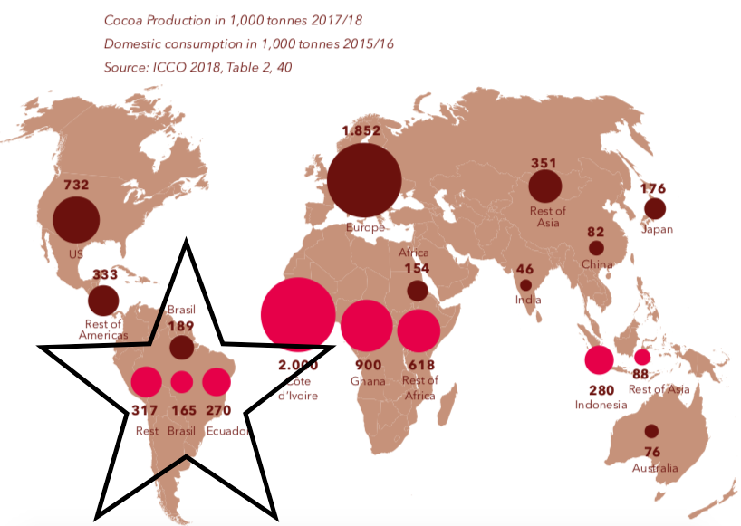

# Brazil 

## The only country worldwide producing cocoa and consuming chocolate.

According to the Cocoa Barometer map [downloadPDF](Cocoaborometer2018_web4.pdf) published in 2018, Brazil:
 * produced 189 tons of cocoa. 
 * consumed 165 tons of chocolate. 

Best case cenario a Brazilian cocoa farmer is paid `R$ 10 per Kg`. 

In Europe, fortunately there is a law which does not allow chocolate to have less than 35% of cocoa in its ingredients. 
This is not the case in other countries! In Brazil is only 25%, but the there is almost no inspection on final products sold on the market.

### Let's compare prices.

| Brazil        | Europe        | 
|:-------------:|:-------------:| 
|               | €2,99 100g one chocolate bunny €1,0465 35g of cocoa   | 
|   `€ 1,81 kg of cocoa beans`           | €29,90 kg of cocoa paste    |

Brazilian farmers receive R$ 10 reais which in 2020 represents `less than 10%` of the final value.

### The Cocoa Chocolate Value Chain has to change not only in Brazil, but Worldwide!

According to one study published in Brazil, between 2017 and 2018, three largest retail brands are responsible for 63.8% of chocolate sold in the country. 

These companies are controlling most part of the value chain. The Netflix series Rotten shows the dark side of consuming chocolate worldwide, this is also a reality in Brazil as these three control the most profitable part of the market.

Watch the trailer: 

 BUT...

1. There is a new concept named bean to bar, such as Tonny's, and it seems to be trending wordwide. 
1. This is happening also in Brazil. In the Amazon jungle!

## And the best is... Brazilian cocoa is reforesting the Amazon jungle.

Pará has a long-term strategic plan called Pró Cacau (download PDF) Programa de Desenvolvimento da Cadeia Produtiva no Estado do Pará, prepared by SEDAP. In 2015 on average cocoa farmers from Pará produced 903 kg of cocoa per hectare! 

According to the World Cocoa Foundation, the average in America is 500 to 600Kg per hectare.
Font: https://www.worldcocoafoundation.org/

BUT HOW? Cocoa is original from the Amazon jungle, which explains the effective production, as well as other factors such as the development of collective regional cultivation.

By consuming chocolate and all cocoa derivatives, consumer helps reforest the jungle, encouraging the production where cocoa is originally from, Amazonas. 